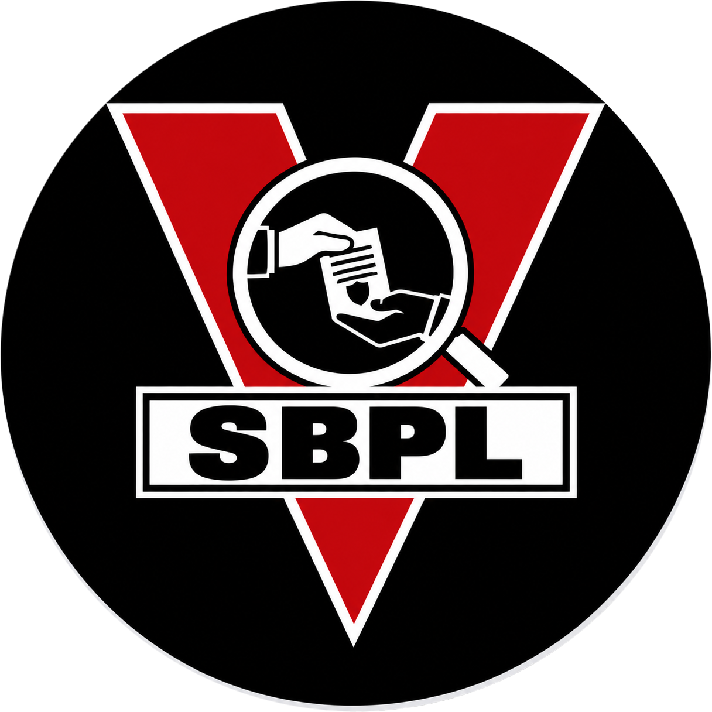
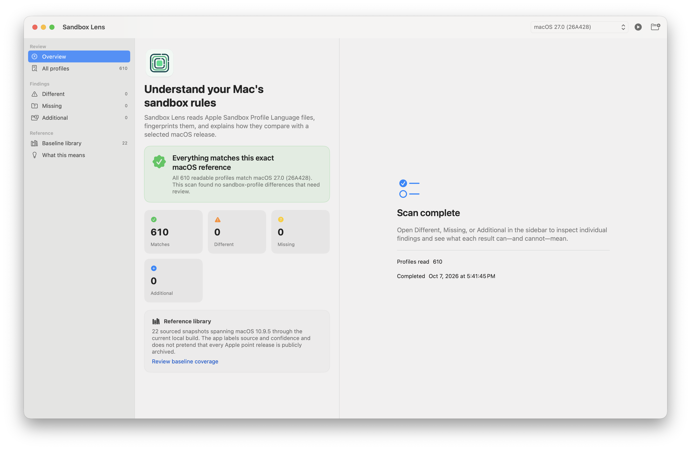
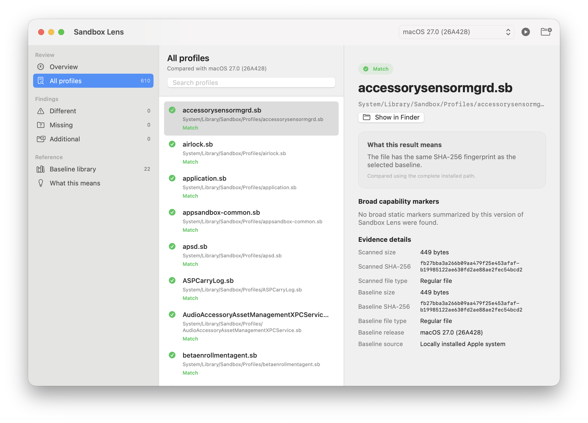
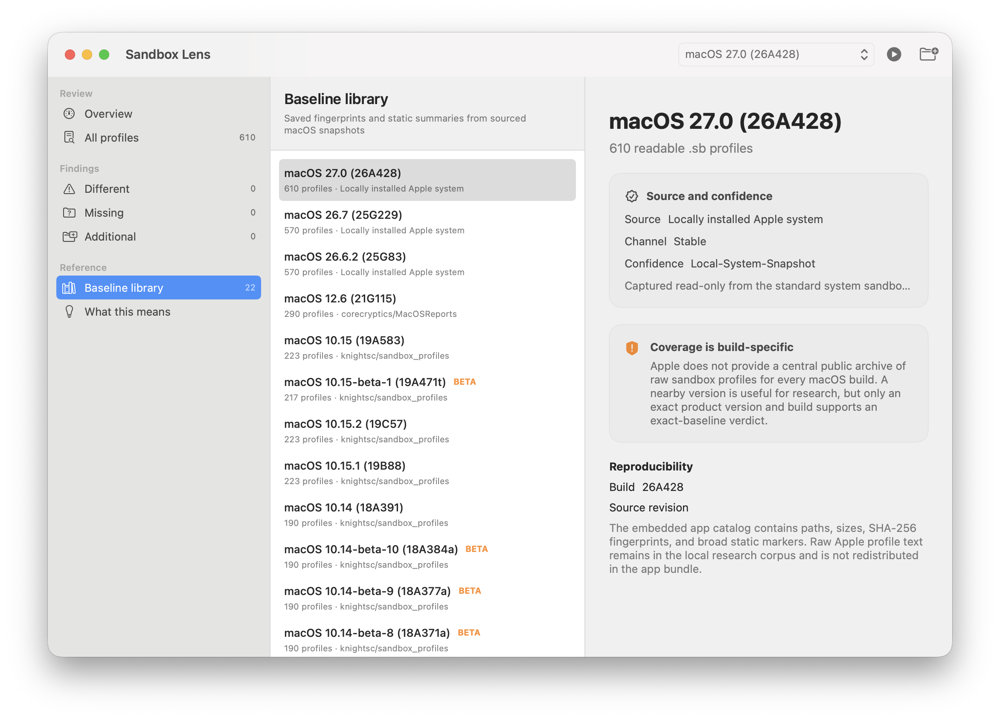
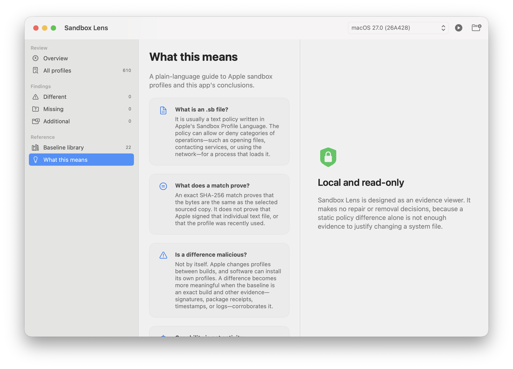

<p align="center">
  
</p>

<h1 align="center">Sandbox Lens</h1>

<p align="center">
  A native, read-only macOS app for comparing readable sandbox profiles with sourced, build-specific references.
</p>

<p align="center">
  <a href="https://github.com/hideouts-io/Sandbox-Lens/actions/workflows/ci.yml"></a>
  <a href="https://github.com/hideouts-io/Sandbox-Lens/releases"></a>
  
  
  
  <a href="LICENSE"></a>
</p>

> [!IMPORTANT]
> Sandbox Lens reports static file differences and broad policy markers. A mismatch, an `allow` rule, or an entitlement-like string is not proof that a profile ran, that an action occurred, or that a Mac is compromised.



## What Sandbox Lens does

Sandbox Lens inventories readable `.sb` files and compares their paths and SHA-256 hashes with a selected macOS reference. It separates exact matches, changed files, expected-but-missing files, and additional files so that ordinary OS-version drift is not presented as malware.

A macOS sandbox profile is a Scheme-like text policy that can restrict which files, services, processes, and network operations a sandboxed process may use. Sandbox Lens reads the policy as evidence; it does not load or enforce it. The app is intended for Mac owners who need a clear first explanation as well as developers, reverse engineers, incident responders, and macOS researchers who need the underlying paths and hashes.

The bundled catalog currently contains **22 build-specific snapshots and 5,342 profile records**, spanning macOS 10.9.5 through macOS 27.0. Coverage is intentionally described as incomplete: Apple does not publish a version-indexed archive of every raw profile, and public snapshots are sparse after Catalina. See [RESEARCH.md](RESEARCH.md) for provenance, known gaps, and the evidence model.

### Highlights

- One-click scan of the two standard macOS profile locations.
- Folder scan for a copied or exported `.sb` collection.
- Exact path and SHA-256 comparison against a selected build.
- Plain-language verdicts with separate Match, Different, Missing, and Additional groups.
- Search across filename, path, and status.
- Narrow static summaries for defaults, broad file/network/process rules, imports, and `no-sandbox` markers.
- Source URL, source revision, build, channel, confidence, and hash details for each reference.
- Runtime research specimen export with original bytes, static provenance, and checksums for external testing.
- Local, read-only scanning; explicit exports create a new folder without modifying source profiles. No uploads, policy execution, compilation, or remediation.

## Start here

1. Open Sandbox Lens.
2. Leave the automatically selected baseline in place when it exactly matches your macOS product version and build.
3. Click **Scan This Mac**.
4. Read the overview before opening individual findings.
5. Treat a non-match as a review item, not a verdict. Confirm the exact OS build and seek independent evidence before drawing a security conclusion.

For exported profiles, click **Scan Copied Folder** and choose the folder that directly contains the copied `.sb` files. Do not choose `/`, `/System`, or another broad system directory.

For external runtime research, select a scanned profile and choose **Export → Runtime research specimen…**. Choose a new folder name. The export contains `profile.sb`, `manifest.json`, `sha256.txt`, and `README.txt`; the included README explains the researcher-managed handoff to PolicyWitness. Export does not compile or execute a policy. Missing and baseline-only rows have no source bytes to export.

## Screenshots

| Exact-build overview | Profile evidence |
|---|---|
|  |  |

| Baseline library | Interpretation guide |
|---|---|
|  |  |

## Install a release

Requirements:

- macOS 13 Ventura or later.
- Apple Silicon or Intel Mac.

Download the universal ZIP and `SHA256SUMS.txt` from the [latest release](https://github.com/hideouts-io/Sandbox-Lens/releases/latest), then verify it in Terminal from the download folder:

```sh
shasum -a 256 -c SHA256SUMS.txt
```

Unzip the archive and move **Sandbox Lens.app** to Applications if desired.

The initial community build is ad-hoc signed with Hardened Runtime enabled. It is **not** signed with an Apple Developer ID and **not** notarized because no distribution signing identity is available for this release. Gatekeeper may therefore require Control-clicking the app, choosing **Open**, and confirming once. Do not disable Gatekeeper globally. See [Signing and distribution](docs/SIGNING.md) for exact verification commands and limitations.

## Understand the results

| Result | Meaning | What it does not prove |
|---|---|---|
| **Match** | The installed path and SHA-256 hash match the selected reference. | That the profile was loaded or every related component is trusted. |
| **Different** | A counterpart exists, but its bytes differ. | Tampering or malicious behavior. Build drift is a common cause. |
| **Missing** | The selected reference expects a path that was not read in the scan. | Deletion by an attacker. OS changes and access limits must be reconciled. |
| **Additional** | The scan contains a profile absent from the selected reference. | Malware. It may belong to another OS build or third-party software. |

An exact match is a byte-identity result. The other categories require interpretation. If the baseline product version and build do not exactly match the Mac, choose the result closest to **version drift**, not **compromise**.

## Supported inputs and analysis boundary

Sandbox Lens reads UTF-8 `.sb` files up to 16 MiB. It recursively enumerates the selected directory without following directory symlinks. Standard scans check:

- `/usr/share/sandbox`
- `/System/Library/Sandbox/Profiles`

The analyzer intentionally recognizes only a small set of textual patterns. It is not an SBPL compiler, parser, runtime tracer, malware detector, or semantic-equivalence engine. Imports, parameters, variables, regular expressions, operation variants, and OS-specific compiler behavior can change effective policy meaning.

## Privacy and safety

- Scans stay on the Mac.
- The app does not require a network connection.
- Profile contents are not included in the bundled catalog; only derived metadata, hashes, provenance, and narrow summaries are shipped.
- The scanner never runs `sandbox-exec`, loads a policy, elevates privileges, bypasses protections, or modifies a scanned file.
- Permission failures are reported explicitly. They are not silently treated as missing files.

## Build from source

Requirements: Xcode or a Swift 6 toolchain on macOS 13 or later.

```sh
git clone https://github.com/hideouts-io/Sandbox-Lens.git
cd Sandbox-Lens
swift test
./script/build_and_run.sh
```

Useful development modes:

```sh
./script/build_and_run.sh --verify
./script/build_and_run.sh --debug
./script/build_and_run.sh --logs
```

The script stages `dist/Sandbox Lens.app`, signs it ad hoc with Hardened Runtime, verifies the bundle, and opens the real app. To create and validate a universal release archive:

```sh
./scripts/package_release.sh
```

That command cleans the package, runs the Swift and Python checks, builds arm64 and x86_64 slices, stages and verifies the app, creates a ZIP, extracts it again, and verifies the extracted copy. See [Technical design](docs/TECHNICAL.md) and [Testing](docs/TESTING.md).

## Baseline research and reproduction

Raw Apple profile text is intentionally ignored by Git and excluded from the app bundle. The app ships derived records. To reproduce the local research corpus:

```sh
./scripts/acquire_public_baselines.sh "$PWD/ResearchCorpus/raw"
./scripts/capture_local_baseline.sh "$PWD/ResearchCorpus/raw"
./scripts/build_baseline_manifest.py \
  --raw-root "$PWD/ResearchCorpus/raw" \
  --output "$PWD/Sources/SandboxLens/Resources/Baselines.json"
```

Every accepted snapshot requires `provenance.json` with a release, build, source URL, exact source revision, confidence, and notes. Independently review new sources before treating them as trusted references.

## Project structure

```text
Assets/                       App icon source and packaged icon
Config/                       Shared version and bundle metadata
ResearchCorpus/               Corpus notes; raw profile text is ignored
Sources/SandboxLens/          Native SwiftUI app and bundled manifest
Tests/                        Swift and Python behavior tests
docs/                         Screenshots and technical documentation
script/build_and_run.sh       Development build, staging, and launch
scripts/                      Baseline, integrity, staging, and release tools
```

## Known limitations

- Public baseline coverage is incomplete and uneven across macOS releases.
- The initial release is not Developer ID signed or notarized.
- Some protected locations may be unreadable under the current user account; the scan reports these failures.
- Static files cannot establish runtime policy use, network traffic, persistence, attribution, or compromise.
- A nearby OS build is context, not an authoritative baseline for another build.

## Troubleshooting

**The app says the folder cannot be completely enumerated.** Choose the folder that directly contains the copied `.sb` files. For installed Apple profiles, use **Scan This Mac** rather than selecting a broad system directory.

**The sidebars are empty after a scan.** Select **All profiles**, **Different**, **Missing**, or **Additional** in the left sidebar. Empty finding categories are expected when every file matches.

**There is no exact baseline for this Mac.** Do not treat the nearest version as authoritative. You can still inventory profiles, but results remain version context until an exact product-version and build reference is available.

**macOS blocks the downloaded app.** Verify the checksum, then use the one-time Control-click **Open** flow described above. The initial build is not notarized; do not disable Gatekeeper globally.

## Contributing and security

Read [CONTRIBUTING.md](CONTRIBUTING.md) before proposing code or a baseline. Reports that add a baseline must include reproducible provenance and must not redistribute material without permission. Please use the private process in [SECURITY.md](SECURITY.md) for vulnerabilities rather than opening a public issue.

## License

Sandbox Lens is available under the [MIT License](LICENSE).

## Acknowledgments

Historical reference material is attributed in [RESEARCH.md](RESEARCH.md), including the `knightsc/sandbox_profiles` and `corecryptics/MacOSReports` projects. Their inclusion as research sources does not imply endorsement of Sandbox Lens.

Another hideouts.io project: [iOS Developer Toolkit](https://github.com/hideouts-io/iOS-Developer-Toolkit).
